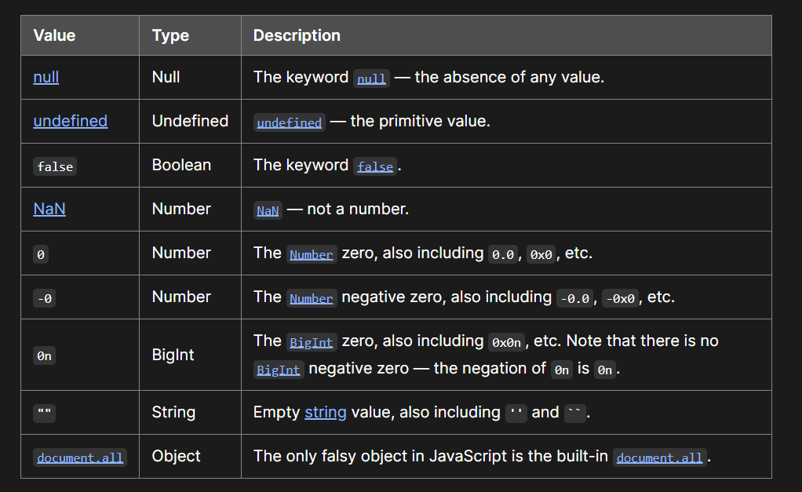

# 1_var_data_type

- var , let , const - favour const , let and don't ever use var
- Global scope, function scope [const,let created block scope]
- Block scope is between { } , function scope is inside function
- Scope pollution is bad, limit scope as possible. Global scope pollution is forbidden
- let, const don't pollute global window scope even if they are in the global scope.

- diffrence between let, const in REASSIGN

- Diffrence between Stack and Heap

- Primitive datatypes

  - Number (there is no int or float all are numbers)
  - string
  - Boolean
  - Null -> indicate empty prense of variable, variable exists but has empty value
  - undefined -> variable dosn't exits
  - Symbole
  - BigInt

# 2_Conversion

- Check file #2 for conversion and coercsion

- Favour using string literal for concatenation and string manipulation

- Coersion is evil in JS, make sure to understand how it work to avoid them.
- Coersion is automatic type casting by JS in case of 2 diffrent types.
- Rules decided base on operator and operand type
- How to avoid? By explist casting in case of 2 diffrent types
- NaN is Not a Number is a special type of number same as 0, 1 Number.isNaN();

# 3_Truthy

- JS is diffrent than Java in falsy and truthy values
- Falsy values 

# 4_Logical_assignment

- Logical operators in assginment

# 5_String_number_math_utils

- Strings are immutable we can't change them
- https://developer.mozilla.org/en-US/docs/Web/JavaScript/Reference/Global_Objects/String
- String utils trim, slice, substring, splice, indexof, replace, charAt, match, includes, startWith

# 6_Date_time

# 7_Function

- Function declaration is subjected to hoisting, means we can call function before its creation.
- Function expresion is not subjected to hoisting and will rais error if you use function before its creation.
- this scope for function will be discussed later
- function parameters in function signature, arguments is value passed to it
- I can set default value for params
- for regular non arrow function there is arguments
- spread param ...param
- To be covered this, call, apply, curry, bind

# 8_Arrays_Objects

- static array vs dynamic array

