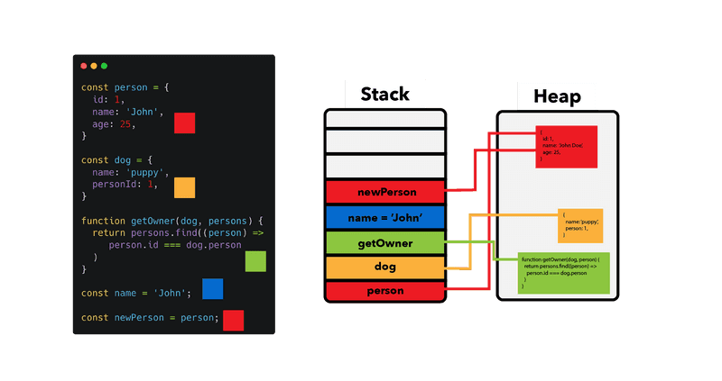

# Welcome 🙋‍♂️ to JS Data Types 🏆

### [🔙 Back To Main Readme](../../../readme.md)

### [🔙 Back To Front-end](../../../readme/front-end.md)

## Data Types

JavaScript variables can hold 2 main types of data:

1. **Primitive Data Types**
2. **Reference Data Types**

JavaScript is a **loosely typed language (also known as a dynamically typed language)**, which means you don't have to declare the data type of a variable when you declare it. The data type will be determined automatically when the variable is **assigned a value**.

### Primitive Data Types

Primitive data types are the most basic data types in JavaScript. They are immutable (cannot be changed) and are copied by value. Which means that when you assign a primitive data type to a variable, you are assigning the actual value of the variable. So when you change the variable, the original value will not be affected. Instead, a new value will be created in memory. They are stored in the stack memory (Later we will talk about the stack memory).

There are 7 primitive data types in JavaScript:

- **String**: Represents a sequence of characters.
- **Number**: Represents numeric values, either integers or floating-point numbers.
- **Boolean**: Represents a logical value, `true` or `false`.
- **Null**: Represents an empty value.
- **Undefined**: Represents a variable that has not been assigned a value.
- **BigInt**: Represents large integers.
- **Symbol**: Represents a unique value.

```javascript
let name = "msanad"; // String
let age = 25; // Number
let weight = 75.5; // Number
let isMale = true; // Boolean
let x = null; // Null
let y; // Undefined
let bigInt = 1234567890123456789012345678901234567890n; // BigInt
let symbol = Symbol("msanad"); // Symbol
```

#### How to check the data type of a variable?

You can use the `typeof` operator to check the data type of a variable. But be aware that there are some bugs in the `typeof` operator. For example, `typeof null` returns `object`, which is a bug in JavaScript.

```javascript
let name = "msanad";
console.log(typeof name); // string
```

### Reference Data Types

Reference data types are objects that are stored in the heap memory (Later we will talk about the heap memory). They are copied by reference. Which means that when you assign a reference data type to a variable, you are assigning the memory address of the object in the heap memory. So when you change the object, all the variables that reference that object will be affected.

There are 3 reference data types in JavaScript:

- **Object**: Represents a collection of key-value pairs.
- **Array**: Represents a collection of elements.
- **Function**: Represents a block of code that can be called.

```javascript
let person = {
  name: "msanad",
  age: 25,
  weight: 75.5,
  isMale: true,
};
console.log(person); // { name: 'msanad', age: 25, weight: 75.5, isMale: true }

let numbers = [1, 2, 3, 4, 5];
console.log(numbers); // [ 1, 2, 3, 4, 5 ]

let greet = function () {
  console.log("Hello, World!");
};
greet(); // Hello, World!
```

We will talk more about objects, arrays, and functions in the upcoming sections.

## Stack Memory and Heap Memory

In JavaScript, memory is divided into 2 main parts:

1. **Stack Memory**: Stores primitive data types and **reference data types variables**, which store the memory address of the object in the heap memory.
2. **Heap Memory**: Stores reference data types objects, the actual object data.

When you declare a variable in JavaScript, the variable is stored in the stack memory. If the variable is a primitive data type, the actual value of the variable is stored in the stack memory. If the variable is a reference data type, the memory address of the object is stored in the stack memory.

When you create an object in JavaScript, the object is stored in the heap memory. The memory address of the object is stored in the stack memory.

When you assign a reference data type to a variable, you are assigning the memory address of the object in the heap memory. So when you change the object, all the variables that reference that object will be affected.

```javascript
// Reference Data Types
let person1 = {
  name: "msanad",
  age: 25,
  weight: 75.5,
  isMale: true,
};
let person2 = person1;
person2.name = "Yassien";
console.log(person1); // { name: 'Yassien', age: 25, weight: 75.5, isMale: true }

let numbers1 = [1, 2, 3, 4, 5];
let numbers2 = numbers1;
numbers2[0] = 10;
console.log(numbers1); // [ 10, 2, 3, 4, 5 ]

// Primitive Data Types
let name = "msanad";
let name2 = name;
console.log(name); // msanad
console.log(name2); // msanad
name2 = "Yassien";
console.log(name); // msanad
console.log(name2); // Yassien
```


Reference of image : https://felixgerschau.com/static/b452488bd7eeac0405c48f164da6280d/5a190/stack-heap-pointers.png

### [ ⏭ Next: Operators](./04_operators.md)

### [🔙 Back To Front-end](../../../readme/front-end.md)

### [🔙 Back To Main Readme](../../../readme.md)
