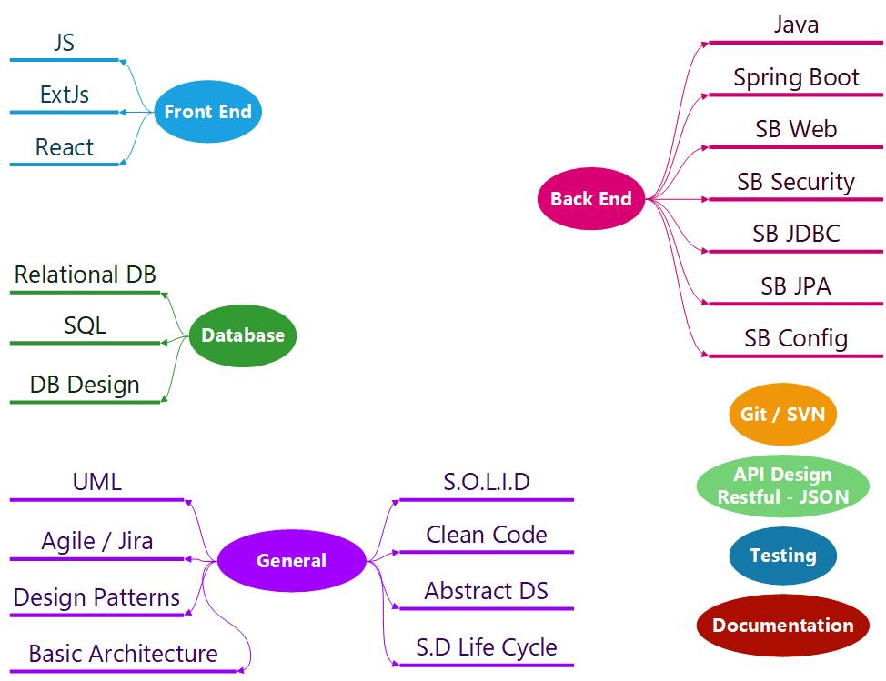

# Welcome 🙋‍♂️ to EZDK New Employees Training 👋

---

## Taining RoadMap

---

## 🔔 Icon Legend 🗺

- 🔥 Important (Is a must)
- 📺 Video Resource
- ➕ Extra Material

---

## [☑ Check List for ITD](./readme/checklist.md) 🔥

## 🛠 Tools / Installations 🔥

- [Tools / Installations Steps 👈](./readme/tools_installations.md)

## ✔ Git / GitHub 📚

- [Git / GitHub Guide 👈](./readme/git.md)

## ☎ Communications 🤳

- [Communication Guide 👈](./readme/communication.md)

## 📎 Task Management 📃

- [Task Management Guide 👈](./readme/task-management.md)

## 🗓 Weekly Team Building Activity 🎈

- [Weekly team building activity Guide 👈](./readme/activity.md)

## 🖊 Evaluation Rubric 🎉

- [Performance Evaluation Guide 👈](./readme/evaluation-rubric.md)

---

## ⚙ Technical Topics Guide 👨‍💻

### [🕸 Front-End 👈](./readme/front-end.md)

### [🎒 Back-End 👈](./readme/back-end.md)

### [🔮 Database 👈](./readme/database.md)

### [🛒 General 👈](./readme/general.md)

---

## Author 📝

**Moataz Sanad** - [LinkedIn](https://www.linkedin.com/in/moatazsanad/)

**Reviewd by MIS Team** 🧐

# 💪 We wish you a successful journey 🚀
