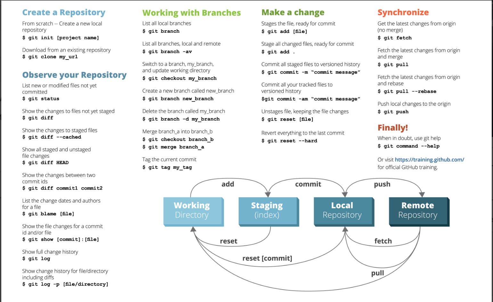

# Welcome 🙋‍♂️ to Git / GitHub Guide 👨‍💻

### [🔙 Back To Main Readme](../readme.md)

🔥 **MAKE SURE you have installed git and github desktop if not revist the tools/installation guide here** 🔥 [Tools/Installions Guide](./tools_installations.md)

## Introduction 📖

In EZDK the main version control is github enterprise, minor projects still exists in SVN (If you are working on a project that uses SVN, you can ask your manager for steps to connect to SVN).

**GitHub Enterprise relies on windows single sign on (SSO) so you need first to authenticate from the browser by visiting [EZDK GitHub Enterprise](https://github.com/enterprises/EZDK/sso)** 🔏

## 🍁 Git Cheat Sheet 🗺

- [Official GitHub Cheat Sheet 👈](../resources/git/git-cheat-sheet-education.pdf)
- [Data Camp Git Cheat Sheet + Explanation 👈](../resources/git/git_cheat_sheet.pdf)
- [Atlasian Git Cheat Sheet + Explanation 👈](../resources/git/SWTM-2088_Atlassian-Git-Cheatsheet.pdf)

👇

## 🏫 Learning Resources 🖋

🚨**Consider any resource with 🔥 is a must.**

- [FireShip Git](https://www.youtube.com/watch?v=hwP7WQkmECE&t=9s) 📺🔥
- [ByteByteGo Git](https://www.youtube.com/watch?v=e9lnsKot_SQ) 📺🔥
- [FreeCodeCamp Full Guide](https://www.youtube.com/watch?v=RGOj5yH7evk) 📺🔥
- [FreeCodeCamp Git](https://www.freecodecamp.org/news/git-and-github-for-beginners/) ➕
- [First Contribution Tutorial](https://github.com/firstcontributions/first-contributions) ➕
- [Official docs](https://git-scm.com/doc) ➕
- [Official Git Book](https://git-scm.com/book/en/v2) ➕

### [🔙 Back To Main Readme](../readme.md)
