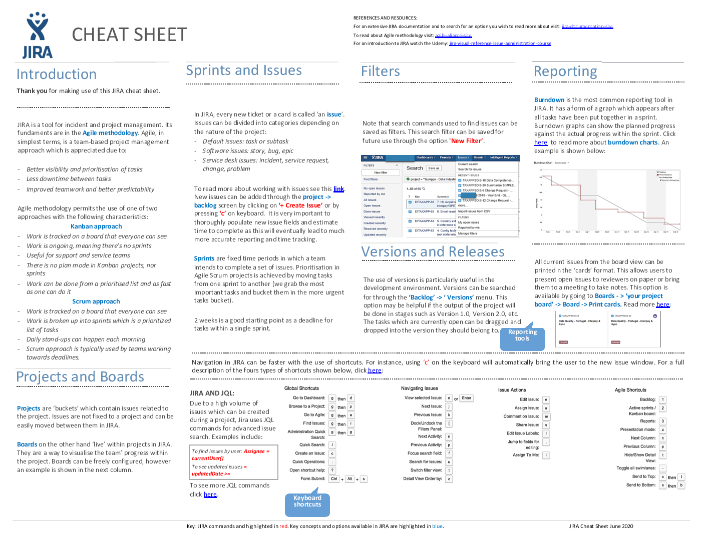

# Welcome 🙋‍♂️ to Task Management Guide 📓

### [🔙 Back To Main Readme](../readme.md)

## 🍁 Agile / JIRA Cheat Sheet 🗺

- [Scrum Cheat Sheet](../resources/agile/ScrumCheatSheet.pdf)
- [Agile Hand Out Cheat Sheet](../resources/agile/Handout-Agile-Scrum-Cheat-Sheet.pdf)
- [Jira JQL Cheat Sheet](../resources/agile/atlassian_jql-cheat-sheet.pdf)

## 🏫 Learning Resources 🖋

🚨**Consider any resource with 🔥 is a must.**

- [Jira Cloud Crash Course](https://www.youtube.com/watch?v=7In-0zO4UjI) 📺 🔥
- EZDK Agile Development Process Presentation `Open the pptx found in resources/agile/EZDK Agile Development Process.pptx` 🔥
- [Official Jira Tutorials](https://www.atlassian.com/agile/tutorials) ➕

For complete reference check `EZDK Agile Software Development Life Cycle Process and Policy`

### [🔙 Back To Main Readme](../readme.md)
